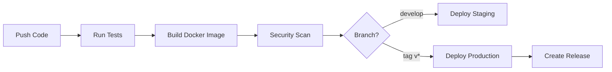

# Django Base Project

[](https://github.com/OWNER/REPO/actions/workflows/docker-image.yml)
[](https://github.com/OWNER/REPO/security/code-scanning)

> **Lưu ý**: Thay `OWNER/REPO` bằng username/repository-name của bạn

## 🚀 Quick Start

### Development (Local)
```bash
python manage.py runserver --settings=config.settings.dev
```

### Development (Docker)
```bash
docker-compose up --build
```

### Production (Docker)
```bash
docker pull ghcr.io/OWNER/REPO:latest
docker run -p 8000:8000 --env-file .env.docker ghcr.io/OWNER/REPO:latest
```

## 📦 Docker Images

| Tag | Description | Status |
|-----|-------------|--------|
| `latest` | Latest stable from main |  |
| `develop` | Latest from develop |  |
| `v1.0.0` | Specific version |  |

## 🔄 CI/CD Pipeline



## 📚 Documentation

- [Docker Setup Guide](DOCKER_README.md)
- [GitHub Actions Guide](GITHUB_ACTIONS_README.md)
- [Quick Reference](.github/QUICK_REFERENCE.md)

## 🛠️ Tech Stack

- **Backend**: Django 4.2
- **Database**: PostgreSQL 15
- **API**: Django REST Framework
- **Authentication**: JWT (SimpleJWT)
- **Server**: Gunicorn
- **Container**: Docker + Docker Compose
- **CI/CD**: GitHub Actions

## 📝 Project Structure

```
myproject/
├── .github/
│   └── workflows/
│       └── docker-image.yml    # CI/CD pipeline
├── apps/                        # Django apps
├── config/                      # Project settings
│   └── settings/
│       ├── base.py
│       ├── dev.py
│       └── production.py
├── requirements/                # Dependencies
│   ├── base.txt
│   ├── dev.txt
│   └── production.txt
├── Dockerfile                   # Multi-stage Docker build
├── docker-compose.yml           # Local development
└── manage.py
```

## 🔐 Environment Variables

Create `.env` file:
```env
DJANGO_SECRET_KEY=your-secret-key
ALLOWED_HOSTS=localhost,127.0.0.1
DEBUG=True
DB_ENGINE=django.db.backends.postgresql
DB_NAME=db_myproject
DB_USER=postgres
DB_PASSWORD=postgres
DB_HOST=localhost
DB_PORT=5432
```

## 🧪 Testing

```bash
# Run all tests
python manage.py test

# Run with coverage
coverage run --source='.' manage.py test
coverage report
```

## 📊 Workflow Status

### Latest Runs
Check [Actions tab](https://github.com/OWNER/REPO/actions) for detailed logs.

### Security Alerts
Check [Security tab](https://github.com/OWNER/REPO/security) for vulnerabilities.

## 🤝 Contributing

1. Fork the repository
2. Create feature branch (`git checkout -b feature/amazing-feature`)
3. Commit changes (`git commit -m 'feat: add amazing feature'`)
4. Push to branch (`git push origin feature/amazing-feature`)
5. Open Pull Request

## 📄 License

This project is licensed under the MIT License.

## 👥 Authors

- Your Name - Initial work

## 🙏 Acknowledgments

- Django Team
- Docker Team
- GitHub Actions Team
